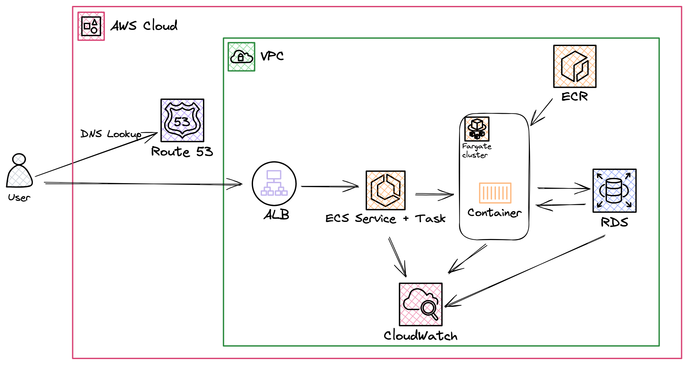

# Saas App infrastructure architecture

Date: `2024-01-09`

## Status

`APPROVED`

## Description 

Below is a basic Infrastructure Architecture Diagram of the Saas app. The diagram is a high level overview of the infrastructure that will be used to host the Saas app.  The diagram is not intended to be a complete representation of the infrastructure, but rather a high level overview of the key components. 

